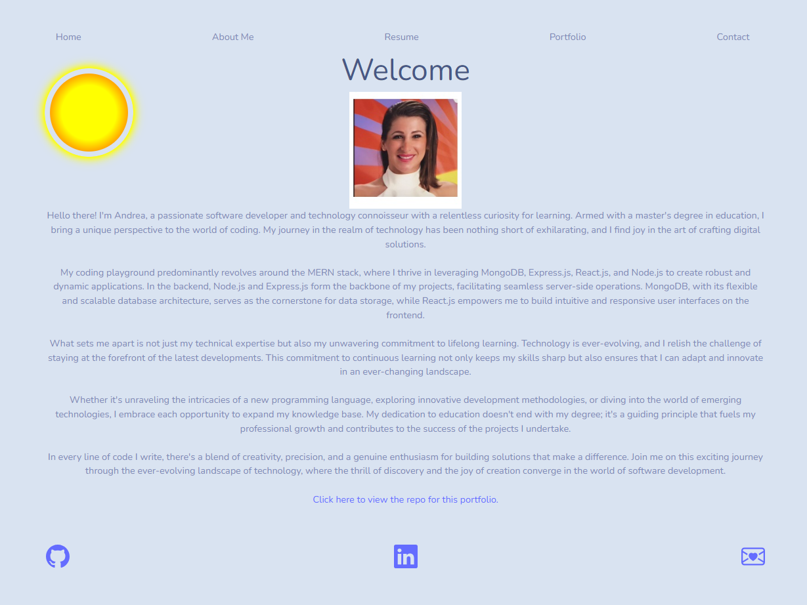

# Andrea-Portfolio
This project is a personal professional portfolio I created using React to demonstrate my skills to industry professionals.

## Table of Contents
- [Installation](#installation)
- [Usage](#usage)
- [Github](#github)
- [Live URL](#live-url)
- [ScreenShot](#screenshot)

## Installation
No installation is necessary. [You can view my portfolio here hosted on netlify.](https://andreakeriazes.netlify.app/)

## Usage
The portfolio is easy to navigate, use the nav-bar at the top of the page to navigate to the different sections. 

* The Home page features a welcome section.
* In the About Me section please enjoy the rain and sun feature I added for fun. You will find a short description of information about myself, my skills, my passions, and my background. At the bottom of the page you will see a link to the portfolio's repo. 
* The Resume page features a link my resume.
* In the Portfolio section you will find various projects I have worked on with a short description and link to bring you to the page. 
* The Contact page has a form you can fill out if you have any questions!
* Throughout the app you will see icons in the footer that will bring you to my Github, Linkedin, and Email.

## Github 
https://github.com/akcodes29/Keriazes-Andrea-Portfolio

## Live URL
Netlify Deployment: https://andreakeriazes.netlify.app/

## ScreenShot
